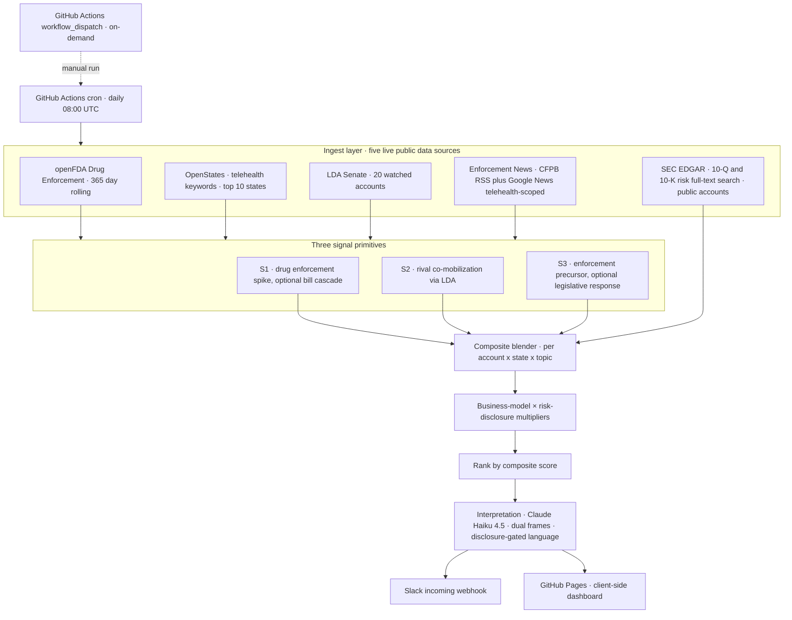

# Interplay GTM Signals · Telehealth & Digital Health Prototype

**Live dashboard:** https://brendahali.github.io/interplay-gtm-signals-prototype-telehealth/

## Executive Summary

This repository documents a time-boxed prototype of a state-policy intelligence engine for the multistate telehealth and digital health vertical. The engine fuses five live public-data sources into a per-account 0-to-100 Signal Strength score across fifty-four ICP-representative operators. Each surfaced alert anchors in a 10-Q risk disclosure the operator's own counsel filed last quarter, turning broad outbound activity into a ranked queue of buying moments tied to named regulatory events. The CRO-visible outcome is sales-cycle compression on accounts where a one-to-three-person government affairs team already recognizes the regulatory issue as material.

---

## Prototype Scope and Production Requirements

The submission is an investigatory exercise that demonstrates signal integration, technical design, and output shape within the brief's time-box. The operator watchlist and segmentation live in §1.1.

A complete GTM machine layers on top of the public-data engine in three ways: empirical analysis of historical sales cycles to isolate which regulatory events drove pipeline in the past; blending of external policy alerts with real-time customer product engagement telemetry (multi-state trend alerts, transcript searches); and CRM status fields that reflect deal state. The architecture is data-driven end to end.

Deploying this into an active GTM machine requires five production inputs:

1. **Paid API tiers.** OpenStates (~$50/month for unmetered access), additional bill-data providers (BillTrack50, LegiScan) for cross-validation, and an active CRM connection (HubSpot Engagements API).
2. **Persistent database storage.** A managed datastore (Cloud SQL, RDS, BigQuery) replacing the local JSON files for multi-day signal history, attribution audit trails, and concurrent access.
3. **Historical deal data.** Six months of historical alert-to-outcome attribution for empirical weight calibration, replacing the heuristic 0.35 / 0.30 / 0.35 weighting prior with evidence-based priors.
4. **Product telemetry integration.** Ingesting customer usage signals from the buyer's product platform as a high-intent fourth signal dimension.
5. **GTM Ops review and feedback loop.** A dedicated ninety-day human-in-the-loop validation phase where GTM Ops manually reviews signal quality and AEs log conversion outcomes. The full three-month cycle refines the signals against measured conversion data and surfaces the engine's impact on sales-cycle compression.

The production pathway depends on these inputs plus the Roadmap items in [`docs/MEMO.md`](docs/MEMO.md).

---

## Submission Package

| Artifact | Where it lives |
|---|---|
| Live dashboard (primary deliverable) | https://brendahali.github.io/interplay-gtm-signals-prototype-telehealth/ |
| Trigger a fresh run | [GitHub Actions workflow_dispatch](https://github.com/BrendaHali/interplay-gtm-signals-prototype-telehealth/actions/workflows/run.yml) → "Run workflow" button. Daily cron also runs at 08:00 UTC. |
| Public repository | https://github.com/BrendaHali/interplay-gtm-signals-prototype-telehealth |
| Decision memo (1-page) | [`docs/MEMO.md`](docs/MEMO.md) |
| Per-task evidence | Task 1 (ICP): §1 · Task 2 (signals): §2 · Task 3 (pipeline): §3 §4 §5 · Task 5 (memo): `docs/MEMO.md` |

---

## 1 · ICP Definition

Fifty-four US multistate telehealth and digital-health operators carry concentrated regulatory exposure across state boards, pharmacy regulators, and interstate compacts (asynchronous prescribing, controlled substances, pharmacy compounding, clinician licensing, Medicaid telehealth reimbursement), forming a fifty-state surface area covered through automated monitoring against the one-to-three-person government affairs teams typical for the segment. The buyer is the General Counsel or Chief Compliance Officer; the champion is the VP Regulatory Affairs or Head of Public Policy. The function is mission-critical with external-tool dependency, supporting both high willingness-to-pay and high renewal stickiness.

### 1.1 · ICP Validation and Segmentation

The thesis validates in the operators' own SEC filings. Public companies disclose the regulatory topics the engine surfaces, in volume, in their most recent 10-Q:

| Account | Ticker | 10-Q topic mentions |
|---|---|---|
| Hims & Hers Health | HIMS | 21 |
| LifeMD | LFMD | 16 |
| WeightWatchers Sequence | WW | 14 |
| GoodRx | GDRX | 14 |
| Talkspace | TALK | 8 |
| Amwell | AMWL | 6 |
| Teladoc Health | TDOC | 4 |

Every signal event evaluates against the full operator universe, capturing each state-policy exposure across the watchlist. The eight operator categories below cover the segment's regulatory chokepoints:

| Segment | Example accounts | Regulatory chokepoint |
|---|---|---|
| Consumer multi-category prescribers | Hims & Hers, Ro, Hers, Thirty Madison | State asynchronous prescribing, pharmacy compounding |
| GLP-1 weight-loss prescribers | LifeMD, Calibrate, Noom, WW Sequence, 9amHealth | Compounded GLP-1, BMI prescribing thresholds |
| ADHD / controlled-substance telehealth | Cerebral, Done Global, Workit Health, Pelago | DEA controlled-substance prescribing, Ryan Haight |
| Mental-health telehealth | Talkspace, Lyra, Spring, Headspace, BetterHelp, Talkiatry, Brightside, Charlie, Quartet | Behavioral health licensing, psychology compact |
| Enterprise virtual care | Teladoc, Amwell, Included Health, Accolade, MDLive, Doctor on Demand | IMLC adoption, Medicaid telehealth reimbursement |
| Primary care + employer health | One Medical, K Health, Galileo, Crossover, Eden, Cleo | Corporate practice of medicine, ERISA preemption |
| Specialty consumer telehealth | Maven, Tia, Wisp, Plume, Folx, Hone, Sword, Curology, Equip, Allara, Pomelo, Origin, Nurx, Twentyeight | Reproductive health rules, gender-affirming care bans, physical therapy licensing |
| Prescription, pharmacy, directory | GoodRx, Zocdoc, Truepill, Honeybee, Capsule, Alto, Lemonaid | State PBM regulation, anti-kickback, pharmacy licensing |

**Pricing alignment.** The buyer offers three tiers (News, Pro, Enterprise). Each opportunity maps to an `expected_deal_band` (`5_top` $200K+ through `1_floor` <$40K) via a pricing function over `topic_exposure`, `employee_count_band`, `funding_stage`, and `target_tier`. Pricing constants live in `scripts/_lib/blender.py` and recalibrate once attribution data yields real win/loss numbers.

**Size-Tier Orchestration.** Size tier governs the composite floor for routing and the AE destination. Routing rules read from `data/scoring_config.yaml`:

| Size tier | Accounts | Composite floor | Routes to | AE assignment |
|---|---|---|---|---|
| Enterprise | 26 | 0.20 | `outputs/alerts.json` (AE queue + Slack) | Named AE per account |
| Midmarket | 18 | 0.40 | `outputs/alerts.json` | Shared midmarket pool |
| Startup | 10 | 0.60 | `data/watchlist_opportunities.json` (capture only) | Pending enrichment |

**Two-Axis Classification.** Size tier and target tier answer different questions:

| Axis | What it captures | What it drives |
|---|---|---|
| Size tier | What the account IS: employee count, funding stage, revenue band | Per-tier composite floor and AE routing destination |
| Target tier | What buyer product fits the regulatory scope: states in play, count of high-risk topic exposures, post-incident operating context | Estimated ACV and expected deal band |

Topic exposure is the primary input to target_tier. Cerebral illustrates the pattern: midmarket headcount, Enterprise fit, because three high-risk topics (controlled-substance telehealth, mental-health telehealth, asynchronous prescribing) across a multistate footprint warrant Enterprise-tier product coverage. Midmarket-size with Enterprise-fit combinations are the highest-conviction expansion targets: regulatory pain (the value driver) operates independently of headcount (the price-tolerance signal).

Profile enrichment covers size tier, employee count band, funding stage, revenue band, target tier, and topic exposure. Seven accounts are public (HIMS, LFMD, TALK, TDOC, AMWL, GDRX, WW); the remaining forty-seven are private. Six accounts carry an `acquired_note` flag for material corporate events (Accolade, One Medical, Alto, Lemonaid, Done Global, Thirty Madison + Nurx); see `data/account_profiles.json`. The interpretation layer gates "10-K" language on `disclosure_source` so the alert copy stays disclosure-accurate across the public-private mix.

---

## 2 · Signal Architecture

Three primitive signal detectors plus one risk-disclosure enrichment. Each primitive maps to a distinct buying moment for the prospect's government affairs team and produces a 0-to-1 score per (account, state, topic) opportunity.

**Hybrid federal-state architecture.** The OpenStates v3 client targets the top 10 states by telehealth volume (CA, NY, TX, IL, FL, PA, OH, GA, NC, MI), which represent over 80% of segment revenue. Federal trackers monitor national datasets (openFDA, LDA Senate, SEC EDGAR, federal agency enforcement news). The Composite Blender then projects national trends onto each account's specific state exposure footprint, surfacing localized vulnerability to a federal cascade while keeping API quota use bounded.

| Signal | What it detects | The buying moment | Data sources | 60-day success metric |
|---|---|---|---|---|
| **S1 Drug Enforcement Cascade** | Statistically significant spike in openFDA enforcement on a telehealth-prescribed drug category (GLP-1s, ADHD stimulants, hormones, SSRIs). Z-score and Poisson upper-tail probability evaluated against a twelve-week baseline; spike-only events fire at 0.75x; spike paired with a forward-only matching state bill within 60 days scores higher. | FDA enforcement on compounded semaglutide sterility or methylphenidate supply is a 30-to-60 day leading indicator of state pharmacy-board or legislative response. GA teams capture the strategic timing window through notification at federal-enforcement time, ahead of state-bill introduction. | openFDA Drug Enforcement, OpenStates bills | At least 60% of S1-routed alerts convert to AE first-touch within 7 days. Quality risk: spike detection firing on noise. |
| **S2 Rival Co-Mobilization** | Two or more named telehealth competitors registering federal lobbying activity on the same prescribing, scope-of-practice, or compact issue within a rolling ninety-day window. Topic classification uses word-boundary regex against LDA general-issue codes. | When two-plus competitors lobby federally on the same issue, state action is statistically more likely than baseline. Multi-competitor convergence is the rare diagnostic event that timely external notification surfaces to the prospect's GA team. | LDA Senate disclosures, competitor pair sets | Post-call AE feedback confirms the prospect's GA team gained the competitive lobbying intel through the call. Quality risk: LDA topic classifier producing alerts the prospect already saw. |
| **S3 Enforcement Precursor** | FDA, FTC, DEA, or state-AG enforcement against a telehealth prescriber or compounding pharmacy. Optional cascade into a state legislative response within fourteen days. Fires at 0.6x as `legislative_response_pending` until a legislative cascade resolves. | An enforcement action against a peer is the single most credible motivating event for a buyer's GA team. The cascade-to-state-hearing window captures the political-cover-for-state-action pattern. | CFPB Newsroom RSS, Google News (telehealth-scoped), OpenStates committee schedules | At least 30% of S3 alerts trigger a meeting where the prospect names the underlying enforcement action as the timing reason. Quality risk: enforcement-to-bill window misaligned. |
| **SEC EDGAR risk-disclosure enrichment** | Counts mentions of each telehealth topic inside each public account's most recent 10-Q / 10-K. Output drives `risk_disclosure_multiplier` (1.0 to 1.3, capped). Private accounts hold at 1.0. | The operator's own filing language is ground-truth evidence the topic is material. When Hims's 10-Q references compounded GLP-1 twenty-one times, an alert on (Hims, compounded_glp1) scores higher than the same alert on a peer with lower disclosure density. | SEC EDGAR full-text search (`efts.sec.gov`), filings index (`data.sec.gov`) | Enrichment, not a routed signal. Success measured by whether public-account alerts cite filing language the prospect's GA team confirms as accurate in the first call. |

### 2.1 · Signal Selection Criteria

Each signal in the portfolio meets four quality criteria: cascade-window leading indicator (notification advantage over commodity legislative-tracking products), enrichment depth (combines bill data with at least one additional public source), scored integration (every input drives composite scoring directly), and ground-truth anchoring (alerts cite evidence the prospect's own counsel disclosed).

Patterns evaluated and excluded from the portfolio:

| Pattern | Rationale for exclusion |
|---|---|
| Bill-status alerts ("HB 123 advanced to committee") | Commodity coverage available through incumbent legislative-tracking products; flagged per the brief's auto-fail criterion |
| Sponsor-count thresholds ("bill has 5+ sponsors") | Decorative; uncorrelated with passage probability or regulatory impact |
| Volume-based news alerts ("3+ mentions of telehealth this week") | Noise-prone; conflates volume with materiality |
| Pure keyword matching on bill text | High false-positive rate; misses the cascade pattern that produces buying moments |
| Hearing-only alerts without enforcement context | Lacks the "why now" anchor that converts an alert into an outbound trigger |

S1 and S3 operate in decoupled-fire mode on most days because the OpenStates free-tier quota (500 daily requests) reaches saturation by the third or fourth refresh. The OpenStates client persists every bill into a cumulative store at `data/openstates_bills.json` and refreshes incrementally; signal detectors operate against the cumulative store between refreshes. A paid tier upgrade in the Roadmap moves S1 and S3 into full cascade mode for every run. S2 is the dominant active signal today because LDA federal filings carry no rate-limit dependency.

---

## 3 · Composite Scoring (Signal Strength)

```
composite = (0.35 × S1 + 0.30 × S2 + 0.35 × S3)
          × business_model_exposure_weight   (1.0 to 1.4, per account)
          × risk_disclosure_multiplier       (1.0 to 1.3, capped, from SEC EDGAR)
```

The dashboard renders the composite scaled to 0–100 as **Signal Strength**. The engagement multiplier activates once HubSpot integration provides real CRM engagement state.

| Component | What it captures | Range | Source |
|---|---|---|---|
| S1 (drug enforcement cascade) | Federal FDA enforcement spike on a telehealth-prescribed drug category, optionally cascading to a state bill within 60 days | 0–1 | openFDA + OpenStates |
| S2 (rival co-mobilization) | Two or more named telehealth competitors registering federal lobbying activity on the same topic in 90 days | 0–1 | LDA Senate |
| S3 (enforcement precursor) | FDA, FTC, DEA, or state-AG enforcement against a telehealth peer, optionally cascading to a state legislative response | 0–1 | News RSS + OpenStates |
| business_model_exposure_weight | Per-account exposure scalar (consumer multi-category prescriber = 1.4, enterprise virtual care = 1.0) | 1.0–1.4 | `data/account_profiles.json` |
| risk_disclosure_multiplier | Public-company 10-Q topic-mention boost (private accounts contribute 1.0) | 1.0–1.3 | SEC EDGAR full-text search |
| **Signal Strength (display)** | composite × 100, rounded to nearest integer | 0–100 | Dashboard derivation |

**Band labels:** HIGH (≥60), MEDIUM (40–59), LOW (<40).

Opportunities above the per-size-tier composite floor (enterprise 0.20, midmarket 0.40, startup 0.60) route to the interpretation layer (Claude Haiku 4.5 with a template fallback). Per-AE daily caps activate once real AE assignments populate through the HubSpot integration. The interpretation layer produces a four-section payload: ten-word-maximum headline, three-to-four sentence body, cold first-touch frame, and worked-deal revival frame. Both frames appear side-by-side so the same payload serves net-new prospecting and worked-deal acceleration.

---

## 4 · Source Verification

Every source operates against live APIs and is verified by `scripts/verify_sources.py`. Numbers refresh on every daily run and persist in `outputs/run_summary.json`.

| Source | URL | Live result |
|---|---|---|
| openFDA Drug Enforcement | api.fda.gov/drug/enforcement.json | 121 records across 6 telehealth-prescribed drug categories in 365 days |
| OpenStates v3 | v3.openstates.org | 323 bills across 6 telehealth keywords in 90 days. Cumulative local store at `data/openstates_bills.json` refreshes incrementally; the 500-daily-request free tier operates as a refresh-rate consideration. |
| LDA Senate disclosures | lda.senate.gov/api/v1/filings | 648 filings across 54 accounts on the most recent live run |
| CFPB Newsroom RSS | consumerfinance.gov/about-us/newsroom/feed | 16 items pulled |
| Google News (telehealth-scoped) | news.google.com/rss/search | 172 raw items across 4 queries in 90 days |
| SEC EDGAR full-text search | efts.sec.gov, data.sec.gov | 83 topic mentions across the seven currently-public accounts' latest 10-Q / 10-K filings (HIMS 21, LFMD 16, WW 14, GDRX 14, TALK 8, AMWL 6, TDOC 4). Two formerly public accounts (Accolade, One Medical) reclassified as private after acquisition. |

---

## 5 · Pipeline Architecture



---

## 6 · Operations

**Production deployment.** GitHub Actions runs the pipeline daily at 08:00 UTC. The workflow ingests fresh data, executes all stages, posts alerts to the configured Slack webhook, regenerates the static site into `site/`, and commits outputs to the main branch.

**Hosting choice.** The prototype hosts the static dashboard on **GitHub Pages**, served directly from the repository via GitHub Actions. The client-side dashboard consumes pre-compiled pipeline outputs, so a dynamic runtime provider adds overhead the prototype does without. At larger production scope (dynamic query runtimes, multi-user authentication, two-way CRM sync), the system would transition to Vercel or **Firebase**. Firebase is the recommended target when the broader GTM and telemetry stack is Google Cloud and BigQuery, given the native, low-latency connectivity and IAM integration.

**Dashboard.** The client-side dashboard at `index.html` reads `outputs/accounts_with_signals.json` (per-account rollup, primary data source), `outputs/account_profiles.json`, `outputs/alerts.json`, and `outputs/run_summary.json` at page load and renders alert cards, signal score breakdowns, source verification indicators, state filters, and search entirely in browser JavaScript. `scripts/generate_site.py` copies the dashboard plus the latest outputs into `site/` for the Pages artifact.

**On-demand execution.** The GitHub Actions Workflow Dispatch endpoint accepts manual triggers from any user with repo access via the "Run workflow" button on the workflow page.

---

## 7 · Local Setup

```bash
git clone https://github.com/BrendaHali/interplay-gtm-signals-prototype-telehealth.git
cd interplay-gtm-signals-prototype-telehealth
pip install -r requirements.txt
cp .env.example .env  # populate API keys

python scripts/verify_sources.py        # confirm all sources operating
python scripts/run_pipeline.py          # full pipeline
python scripts/run_pipeline.py --skip-ingest  # re-run against cached data
python scripts/generate_site.py         # copy dashboard + outputs into site/
open index.html                         # dashboard reads outputs/ directly
```

---

## 8 · Documentation

| Document | Purpose |
|---|---|
| [`docs/MEMO.md`](docs/MEMO.md) | One-page decision memo: Executive Summary, Prototype Scope & Strategic Context, Key Design Decisions, Operational Pilot & Recommendation. |
